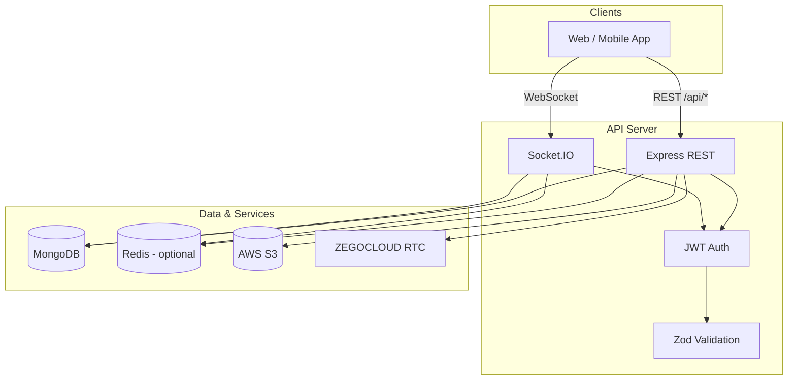

# Connectify — Real-Time Chat & Social Backend

Production-oriented REST and WebSocket API for a full-featured messaging and social app: authentication, friend graph, direct messaging (text, images, voice), social feed, presence, and audio calls powered by ZEGOCLOUD.

Built with **Node.js**, **Express**, **TypeScript**, **MongoDB**, **Socket.IO**, and optional **Redis** for caching and horizontal scaling.

---

## Highlights for reviewers

| Area | Implementation |
|------|----------------|
| **API design** | RESTful modules, Zod request validation, consistent `{ success, data \| message }` responses |
| **Real-time** | Socket.IO with JWT auth, per-user rooms, typing/read receipts, call signaling |
| **Security** | bcrypt (12 rounds), HTTP-only JWT cookies, CORS allowlist, auth rate limiting |
| **Media** | AWS S3 uploads (avatars, post/message images, voice notes) |
| **Scale-ready** | Redis cache layer, Socket.IO Redis adapter for multi-instance fan-out |
| **Calls** | Server-minted ZEGOCLOUD RTC tokens; call state + logs via WebSocket events |

---

## Features

- **Authentication** — Register, login, logout, session via JWT (Bearer header or HTTP-only cookie)
- **User profiles** — Rich profile fields, avatar upload, user search with pagination
- **Friends** — Send, accept, reject, cancel friend requests; friends list
- **Messaging** — 1:1 chat with text, images, voice (≤60s), replies, edit/delete, read receipts
- **Real-time** — Live delivery, typing indicators, presence (online/last seen) for friends only
- **Chats** — Conversation list with last message preview and unread counts
- **Social feed** — Posts with images, likes, threaded comments
- **Voice calls** — Invite/accept/reject flow over sockets; ZEGOCLOUD RTC tokens from REST
- **Operations** — Health check, graceful shutdown, structured error handling

---

## Tech stack

| Layer | Technology |
|-------|------------|
| Runtime | Node.js 20+ |
| Language | TypeScript 5 |
| HTTP | Express 4 |
| Database | MongoDB (Mongoose 8) |
| Real-time | Socket.IO 4 |
| Cache / pub-sub | Redis (ioredis, optional) |
| Object storage | AWS S3 |
| Calls | ZEGOCLOUD (server-side token generation) |
| Validation | Zod |
| Auth | jsonwebtoken, bcryptjs |

---

## Architecture



**Request flow (REST):** Client → CORS → JSON body parser → route handler → service layer → MongoDB / S3 / Redis → JSON response.

**Request flow (real-time):** Client connects with JWT → joins `user:{userId}` room → emits events (message, typing, call) → server persists when needed and fans out to peer rooms.

---

## Project structure

```
src/
├── app.ts                 # Express app, routes, middleware
├── index.ts               # HTTP server, Socket.IO bootstrap
├── config/                # env, database, redis, s3, cors, zego
├── middleware/            # auth, validation, uploads, rate limits, errors
├── modules/
│   ├── auth/              # Registration, login, account
│   ├── user/              # Profiles, search
│   ├── friendRequest/     # Friend graph
│   ├── message/           # Messages CRUD
│   ├── chat/              # Conversation list
│   ├── post/              # Feed, likes, comments
│   └── call/              # ZEGOCLOUD config & tokens
├── socket/                # Real-time handlers (messages, calls)
├── services/              # Presence
├── cache/                 # Redis keys & invalidation
└── utils/                 # JWT, errors, helpers
```

---

## Getting started

### Prerequisites

- **Node.js** 20 or later
- **MongoDB** 6+ (local or Atlas)
- **AWS S3** bucket and IAM credentials (required for image/voice uploads)
- **Redis** (optional; recommended for production caching and multi-instance sockets)
- **ZEGOCLOUD** account (optional; required only for voice calls)

### Installation

```bash
git clone <repository-url>
cd chatting-app-backend
npm install
cp .env.example .env
# Edit .env with your values (see Environment variables)
```

### Environment variables

Copy `.env.example` to `.env` and configure:

| Variable | Required | Description |
|----------|----------|-------------|
| `PORT` | No | Server port (default `5001`) |
| `NODE_ENV` | No | `development` \| `production` \| `test` |
| `MONGODB_URI` | Yes | MongoDB connection string |
| `JWT_SECRET` | Yes | Min 16 characters |
| `JWT_EXPIRES_IN` | No | Token TTL (default `7d`) |
| `CLIENT_URL` | No | Comma-separated CORS origins |
| `AWS_REGION` | Yes | S3 bucket region |
| `AWS_ACCESS_KEY_ID` | Yes | IAM access key |
| `AWS_SECRET_ACCESS_KEY` | Yes | IAM secret |
| `AWS_BUCKET_NAME` | Yes | S3 bucket name |
| `REDIS_URL` | No | Redis URL (Upstash, ElastiCache, etc.) |
| `REDIS_ENABLED` | No | Set `true` to enable caching |
| `SOCKET_REDIS_ADAPTER` | No | Enable Socket.IO Redis adapter (needs Redis) |
| `ZEGOCLOUD_*` | No | App ID, sign, secret, server URL for calls |

See [`.env.example`](.env.example) for a full template.

### Run locally

```bash
# Development (hot reload)
npm run dev

# Production build
npm run build
npm start
```

Server listens on `http://localhost:5001` (or your `PORT`).

### Verify

```bash
curl http://localhost:5001/health
```

Expected response:

```json
{
  "success": true,
  "message": "Server is running",
  "redis": "connected"
}
```

(`redis` may be `"disabled"` if Redis is off.)

---

## API documentation

Full endpoint reference, request/response shapes, and WebSocket event catalog:

**[docs/API.md](docs/API.md)**

Quick reference:

| Prefix | Purpose |
|--------|---------|
| `GET /health` | Liveness + Redis status |
| `/api/auth` | Register, login, session, account |
| `/api/users` | Profile, search |
| `/api/friend-requests` | Friend graph |
| `/api/messages` | Send, list, edit, delete, mark read |
| `/api/chats` | Conversation list, delete thread |
| `/api/posts` | Feed, posts, likes, comments |
| `/api/calls` | ZEGOCLOUD config & RTC tokens |

**Authentication:** Protected routes accept `Authorization: Bearer <token>` or the `token` HTTP-only cookie set on register/login.

**WebSocket:** Connect to the same host/port as the HTTP server. Pass JWT via `auth.token` or `Authorization` header. See [docs/API.md](docs/API.md#websocket-events).

---

## Design decisions

1. **Dual transport for messages** — REST for uploads and reliability; Socket.IO for low-latency text and live updates. Both paths share `messageService` so behavior stays consistent.

2. **Friend-scoped presence** — Online status is broadcast only to friends, not globally, to limit fan-out at scale.

3. **Optional Redis** — The app runs without Redis; when enabled, chat lists and profiles are cached with targeted invalidation on writes.

4. **Call disconnect grace** — A 15s grace period on socket disconnect avoids ending active calls on brief mobile network drops.

5. **Soft deletes** — Messages are marked `isDeleted` rather than removed, preserving conversation integrity and reply context.

---

## Scripts

| Command | Description |
|---------|-------------|
| `npm run dev` | Start with `tsx watch` |
| `npm run build` | Compile TypeScript to `dist/` |
| `npm start` | Run compiled `dist/index.js` |

---

## Related documentation

- [API Reference](docs/API.md) — REST endpoints, payloads, errors, Socket.IO events
- [Environment template](.env.example) — All configuration variables

---

## License

Private project — all rights reserved unless otherwise specified by the repository owner.
