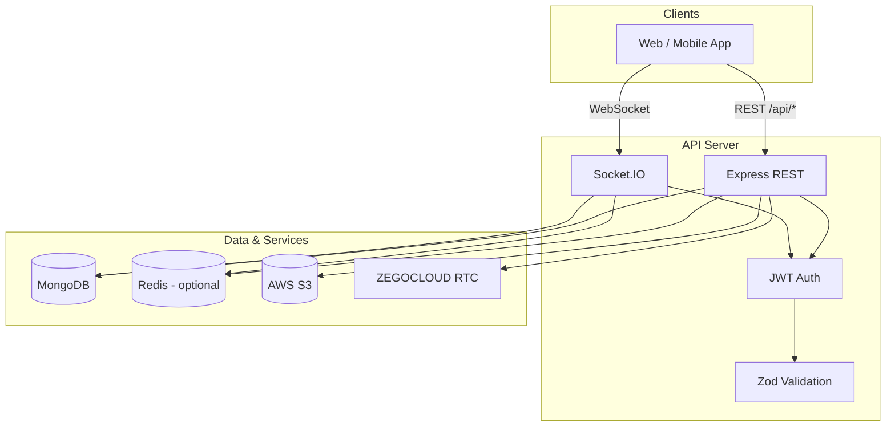

# Connectify — Backend

> **About:** REST and WebSocket API for [Connectify](https://easy-connectify.vercel.app) — real-time 1:1 chat, social feed, friends, presence, S3 media, and ZEGOCLOUD voice calls. Web client: [connectify-frontend](https://github.com/reazulislamreaz/connectify-frontend).


Production-oriented **Node.js** API: authentication, friend graph, direct messaging (text, images, voice), social feed, presence, and audio calls.

Built with **Express**, **TypeScript**, **MongoDB**, **Socket.IO**, and optional **Redis** for caching and horizontal scaling.

| | |
|---|---|
| **Live API** | [https://easyconnectify.duckdns.org](https://easyconnectify.duckdns.org) |
| **Live app** | [https://easy-connectify.vercel.app](https://easy-connectify.vercel.app) |
| **Frontend repo** | [connectify-frontend](https://github.com/reazulislamreaz/connectify-frontend) |

---

## Highlights for reviewers

| Area | Implementation |
|------|----------------|
| **API design** | RESTful modules, Zod request validation, consistent `{ success, data \| message }` responses |
| **Real-time** | Socket.IO with JWT auth, per-user rooms, typing/read receipts, call signaling |
| **Security** | bcrypt (12 rounds), HTTP-only JWT cookies, CORS allowlist, Helmet headers, Redis-backed rate limiting (distributed, fail-open) |
| **Roles & moderation** | RBAC (`user`/`moderator`/`admin`) re-checked from DB per request, privacy-safe admin dashboard, user reports queue, append-only audit log |
| **Media** | AWS S3 uploads (avatars, post/message images, voice notes) |
| **Email** | Password-reset & confirmation emails via SMTP **or** Amazon SES, deliverability-tuned templates |
| **Scale-ready** | Redis cache layer, Socket.IO Redis adapter for multi-instance fan-out |
| **Calls** | Server-minted ZEGOCLOUD RTC tokens; call state + logs via WebSocket events |
| **AI (planned)** | On-demand `/api/ai/*` — smart reply, translation, summaries, moderation, transcription |

---

## Features

- **Authentication** — Register, login, logout, session via JWT (Bearer header or HTTP-only cookie)
- **User profiles** — Rich profile fields, avatar upload, user search with pagination
- **Friends** — Send, accept, reject, cancel friend requests; friends list
- **Messaging** — 1:1 chat with text, images, voice (≤60s), replies, edit/delete, read receipts
- **Real-time** — Live delivery, typing indicators, presence (online/last seen) for friends only
- **Chats** — Conversation list with last message preview and unread counts
- **Social feed** — Posts with images, likes, threaded comments
- **Voice & video calls** — Invite/accept/reject flow over sockets; `callType` (`audio`/`video`); ZEGOCLOUD RTC tokens from REST
- **Password reset** — Email-based forgot/reset flow (single-use, 60-min token) via SMTP or Amazon SES
- **Admin & moderation** — Staff-only dashboard: aggregate stats, user management (suspend/ban/role), public-content moderation, user-report queue, and an immutable audit log — without ever reading private messages
- **Operations** — Health check, graceful shutdown, structured error handling

---

## Roadmap — AI features (planned)

AI capabilities are **not implemented yet**. They are on the product roadmap to add everyday value for users (faster replies, safer community, easier catch-up) without replacing core messaging or real-time delivery.

### Planned capabilities

| Feature | Value for users |
|---------|-----------------|
| **Smart reply** | One-tap reply suggestions in 1:1 chat — less typing, faster conversations |
| **Message translation** | Chat across languages (e.g. Bengali ↔ English) without leaving the app |
| **Chat summary** | Catch up on long threads with a short recap instead of scrolling hundreds of messages |
| **Content moderation** | Safer feed and DMs — detect toxic, spam, or abusive text (and optionally images) before or after publish |
| **Voice transcription** | Turn voice notes into readable text — accessibility, search, and skim-at-a-glance |
| **In-app AI assistant** | Help draft messages or posts, rephrase tone, or answer questions in context |
| **Semantic search** | Find messages or posts by meaning, not only exact keywords |

### How it will fit this backend

- New module: `src/modules/ai/` with routes under `/api/ai/*` (JWT-protected, rate-limited).
- AI runs **on demand** — not on the hot path for `POST /api/messages` or Socket.IO `send_message` / `receive_message`, so normal chat stays fast.
- Provider options (choose per environment):
  - **Managed API** (OpenAI, Anthropic, etc.) — fastest to ship; pay per request.
  - **Self-hosted Ollama** — no per-token bill; you host models on your own GPU/server (hardware and ops cost instead).
- Heavy work (e.g. moderation scans, long summaries) can use **async jobs** or queues later if volume grows.

### Suggested rollout order

1. Smart reply + translation — highest daily use in chat.
2. Voice transcription + chat summary — builds on existing voice messages and thread history.
3. Content moderation — protect feed and DMs as usage grows.
4. Semantic search + in-app assistant — broader discovery and productivity.

See [docs/API.md](docs/API.md) for current endpoints; AI routes will be documented there when shipped.

### Voice calls — troubleshooting

Calls need **two layers** working: Socket.IO signaling, then ZEGOCLOUD audio.

| Symptom | Likely cause | Fix |
|---------|----------------|-----|
| No incoming ring on callee | Socket not connected or CORS | Add frontend origin to `CLIENT_URL` (e.g. `https://easy-connectify.vercel.app`). Use `https://` for `NEXT_PUBLIC_SOCKET_URL` on Vercel. |
| Toast: "Could not start call" / "You can only call friends" | Not friends or socket error | Both users must be **accepted friends**. Check browser console / Network for socket errors. |
| Toast: "User is busy" | Stuck in-memory call state | Both refresh; restart API if needed (call state is in server RAM). |
| Ring works, then "Could not connect audio call" | Zego **200101 auth failure** (token rejected) | In [ZEGOCLOUD console](https://console.zegocloud.com), open the project for your App ID, copy **Server Secret** (32 chars only — not App Sign). Set `ZEGOCLOUD_SERVER_SECRET` on the VPS to match that project, then restart the API. |
| Toast: ZEGOCLOUD_APP_ID message | `appId` is 0 on server | Same as above — production VPS `.env` must match console, not only local `.env`. |
| No audio after "On call" | Mic permission or browser | Allow microphone; use HTTPS (Vercel is fine). |

**Quick checks**

```bash
# Server up
curl https://easyconnectify.duckdns.org/health

# Socket.IO reachable (should be 200)
curl -o /dev/null -w "%{http_code}\n" \
  "https://easyconnectify.duckdns.org/socket.io/?EIO=4&transport=polling"

# After login, config should show appId > 0
curl -H "Authorization: Bearer <jwt>" https://easyconnectify.duckdns.org/api/calls/config
```

**Production checklist:** `CLIENT_URL` includes Vercel URL · ZEGOCLOUD vars on **VPS** · both users logged in with socket connected (messages/delivery work) · friends · mic allowed.

---

## Tech stack

| Layer | Technology |
|-------|------------|
| Runtime | Node.js 20+ |
| Language | TypeScript 5 |
| HTTP | Express 4 |
| Database | MongoDB (Mongoose 8) |
| Real-time | Socket.IO 4 |
| Cache / pub-sub | Redis (ioredis, optional) |
| Object storage | AWS S3 |
| Calls | ZEGOCLOUD (server-side token generation) |
| Validation | Zod |
| Auth | jsonwebtoken, bcryptjs |

---

## Architecture



**Request flow (REST):** Client → CORS → JSON body parser → route handler → service layer → MongoDB / S3 / Redis → JSON response.

**Request flow (real-time):** Client connects with JWT → joins `user:{userId}` room → emits events (message, typing, call) → server persists when needed and fans out to peer rooms.

---

## Project structure

```
src/
├── app.ts                 # Express app, routes, middleware
├── index.ts               # HTTP server, Socket.IO bootstrap
├── config/                # env, database, redis, s3, cors, zego
├── middleware/            # auth, validation, uploads, rate limits, errors
├── modules/
│   ├── auth/              # Registration, login, account
│   ├── user/              # Profiles, search
│   ├── friendRequest/     # Friend graph
│   ├── message/           # Messages CRUD
│   ├── chat/              # Conversation list
│   ├── post/              # Feed, likes, comments
│   ├── call/              # ZEGOCLOUD config & tokens
│   ├── admin/             # Staff dashboard, moderation, reports, audit log
│   └── ai/                # (planned) LLM features — smart reply, translate, summarize, etc.
├── socket/                # Real-time handlers (messages, calls)
├── services/              # Presence
├── cache/                 # Redis keys & invalidation
└── utils/                 # JWT, errors, helpers
```

---

## Getting started

### Prerequisites

- **Node.js** 20 or later
- **MongoDB** 6+ (local or Atlas)
- **AWS S3** bucket and IAM credentials (required for image/voice uploads)
- **Redis** (optional; recommended for production caching and multi-instance sockets)
- **ZEGOCLOUD** account (optional; required only for voice calls)

### Installation

```bash
git clone https://github.com/reazulislamreaz/connectify-backend.git
cd connectify-backend
npm install
cp .env.example .env
# Edit .env with your values (see Environment variables)
```

### Environment variables

Copy `.env.example` to `.env` and configure:

| Variable | Required | Description |
|----------|----------|-------------|
| `PORT` | No | Server port (default `5001`) |
| `NODE_ENV` | No | `development` \| `production` \| `test` |
| `MONGODB_URI` | Yes | MongoDB connection string |
| `JWT_SECRET` | Yes | Min 16 characters |
| `JWT_EXPIRES_IN` | No | Token TTL (default `7d`) |
| `CLIENT_URL` | No | Comma-separated CORS origins |
| `AWS_REGION` | Yes | S3 bucket region |
| `AWS_ACCESS_KEY_ID` | Yes | IAM access key |
| `AWS_SECRET_ACCESS_KEY` | Yes | IAM secret |
| `AWS_BUCKET_NAME` | Yes | S3 bucket name |
| `REDIS_URL` | No | Redis URL (Upstash, ElastiCache, etc.) |
| `REDIS_ENABLED` | No | Set `true` to enable caching |
| `SOCKET_REDIS_ADAPTER` | No | Enable Socket.IO Redis adapter (needs Redis) |
| `ZEGOCLOUD_*` | No | App ID, sign, secret, server URL for calls |
| `FRONTEND_URL` | No | Base URL used in email links (falls back to first non-localhost `CLIENT_URL`) |
| `MAIL_PROVIDER` | No | `smtp` (default) or `ses` |
| `SMTP_HOST` / `SMTP_PORT` / `SMTP_SECURE` | No | SMTP server (when `MAIL_PROVIDER=smtp`) |
| `SMTP_USER` / `SMTP_PASS` | No | SMTP credentials |
| `MAIL_FROM` / `MAIL_FROM_NAME` | No | Sender address & display name (SES requires a verified `MAIL_FROM`) |
| `MAIL_PLAIN_ONLY` | No | Force text-only emails (defaults `true` for Gmail SMTP senders) |

Email is optional: when SMTP/SES is not configured, password-reset emails are skipped (logged in development). See [`.env.example`](.env.example) for a full template, including Google Workspace and SES setup notes.

### Run locally

```bash
# Development (hot reload)
npm run dev

# Production build
npm run build
npm start
```

Server listens on `http://localhost:5001` (or your `PORT`) when running locally.

### Verify

**Production**

```bash
curl https://easyconnectify.duckdns.org/health
```

**Local**

```bash
curl http://localhost:5001/health
```

Expected response:

```json
{
  "success": true,
  "message": "Server is running",
  "redis": "connected"
}
```

(`redis` may be `"disabled"` if Redis is off.)

---

## API documentation

Full endpoint reference, request/response shapes, and WebSocket event catalog:

**[docs/API.md](docs/API.md)**

### Base URLs

| Environment | Base URL |
|-------------|----------|
| **Production** | `https://easyconnectify.duckdns.org` |
| **Local** | `http://localhost:5001` |

All REST routes are prefixed with the base URL. Examples:

- Health: `GET https://easyconnectify.duckdns.org/health`
- Register: `POST https://easyconnectify.duckdns.org/api/auth/register`
- Messages: `POST https://easyconnectify.duckdns.org/api/messages`

Quick reference:

| Prefix | Purpose |
|--------|---------|
| `GET /health` | Liveness + Redis status |
| `/api/auth` | Register, login, session, account |
| `/api/users` | Profile, search |
| `/api/friend-requests` | Friend graph |
| `/api/messages` | Send, list, edit, delete, mark read |
| `/api/chats` | Conversation list, delete thread |
| `/api/posts` | Feed, posts, likes, comments |
| `/api/calls` | ZEGOCLOUD config & RTC tokens |
| `/api/admin` | Staff-only: stats, users, content moderation, reports, audit log |
| `/api/reports` | File a report on a post/comment/user/message (any user) |

**Authentication:** Protected routes accept `Authorization: Bearer <token>` or the `token` HTTP-only cookie set on register/login.

**Authorization:** Users have a `role` (`user`/`moderator`/`admin`). `/api/admin/*` requires staff; some actions require `admin`. The JWT `role` is a UI hint only — the server re-checks role and account status against the database on every staff request. Seed the first admin with `npx tsx scripts/make-admin.ts you@example.com`.

**WebSocket:** Connect to the same host as the HTTP server. Pass JWT via `auth.token` or `Authorization` header. See [docs/API.md](docs/API.md#websocket-events).

```javascript
import { io } from "socket.io-client";

// Production
const socket = io("https://easyconnectify.duckdns.org", {
  auth: { token: "<jwt>" },
});

// Local development
// const socket = io("http://localhost:5001", { auth: { token: "<jwt>" } });
```

---

## Design decisions

1. **Dual transport for messages** — REST for uploads and reliability; Socket.IO for low-latency text and live updates. Both paths share `messageService` so behavior stays consistent.

2. **Friend-scoped presence** — Online status is broadcast only to friends, not globally, to limit fan-out at scale.

3. **Optional Redis** — The app runs without Redis; when enabled, chat lists and profiles are cached with targeted invalidation on writes.

4. **Call disconnect grace** — A 15s grace period on socket disconnect avoids ending active calls on brief mobile network drops.

5. **Soft deletes** — Messages are marked `isDeleted` rather than removed, preserving conversation integrity and reply context.

---

## Scripts

| Command | Description |
|---------|-------------|
| `npm run dev` | Start with `tsx watch` |
| `npm run build` | Compile TypeScript to `dist/` |
| `npm start` | Run compiled `dist/index.js` |

---

## Related documentation

- [API Reference](docs/API.md) — REST endpoints, payloads, errors, Socket.IO events
- [Environment template](.env.example) — All configuration variables

---

## License

Private project — all rights reserved unless otherwise specified by the repository owner.
